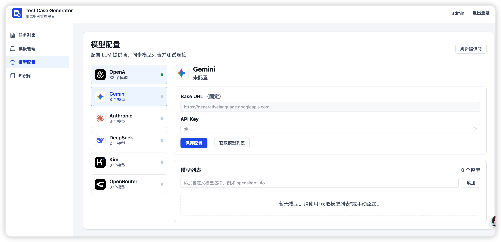
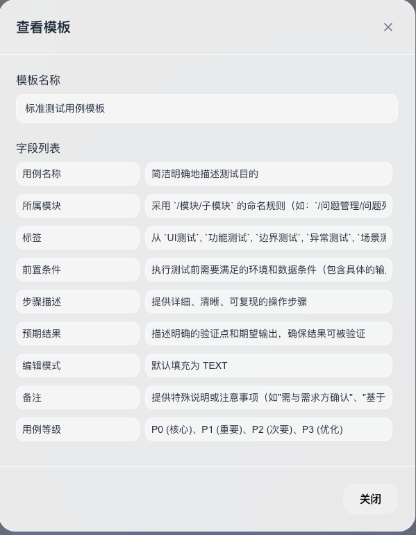
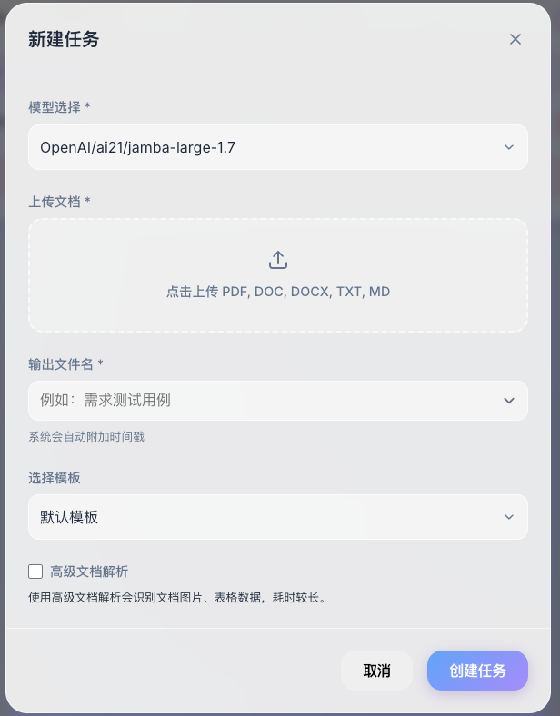
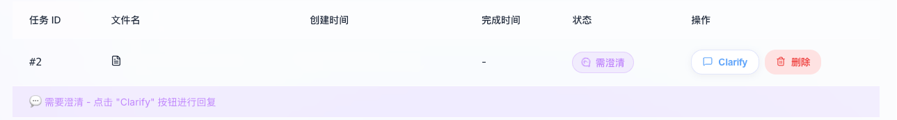
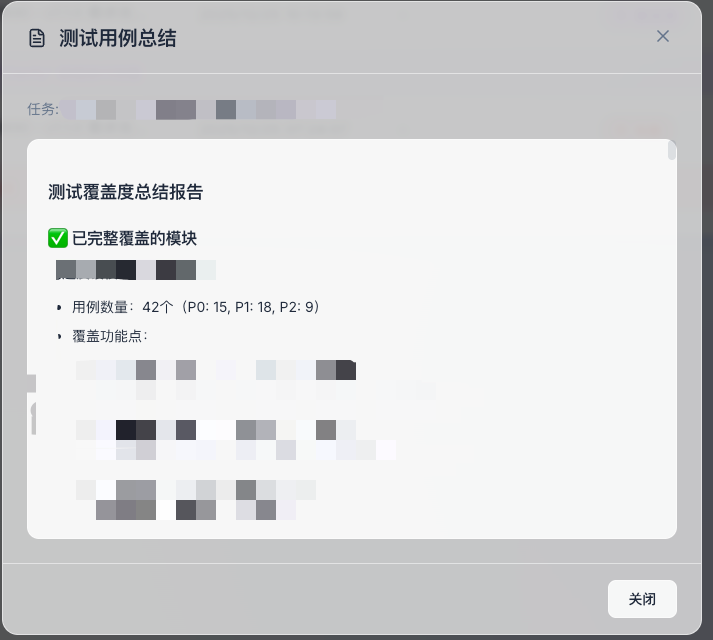

# Test Case Generator

基于 **FastAPI、LangGraph 和 Vue 3** 的智能测试用例生成平台。上传需求文档、选择已配置的大语言模型，即可生成结构化测试用例、测试覆盖总结和 Excel 文件；还支持自定义输出模板、知识库 RAG、需求澄清和历史任务管理。

> 当前生产前端为 `frontend/`。仓库中的 `frontend-react/` 是保留的 React 旧版实现，仅供回退和对照，不会被 Docker 镜像构建。

## 功能特性

- **需求文档解析**：支持 `PDF`、`DOC`、`DOCX`、`TXT`、`MD`，提取正文、表格及 PDF 图片信息。
- **测试用例生成**：以 LangGraph 四阶段工作流完成需求分析、测试策略、用例生成和覆盖总结。
- **人机澄清**：需求信息不足时，任务进入待澄清状态；补充说明后可继续执行。
- **多模型配置**：支持 OpenAI、Gemini、Anthropic、DeepSeek、Kimi、OpenRouter 的模型配置、模型管理和连接测试。
- **用例模板**：通过自定义字段控制生成表格的输出结构；系统模板仅支持查看。
- **知识库 RAG**：按项目上传多个关联文档，以向量检索结果补充测试用例生成上下文。
- **结果管理**：查看任务进度和总结，下载 Excel，停止或删除历史任务。
- **Vue 管理界面**：提供任务、模板、模型配置和知识库的完整管理页面。

## 界面预览

| 模型配置 | 模板管理 |
| --- | --- |
|  |  |

| 文档解析 | 澄清交互 |
| --- | --- |
|  |  |



## 架构概览

```text
Vue 3 + Vite SPA
        │ /api/v1
        ▼
FastAPI
 ├── 认证、任务、模板、模型配置、知识库 API
 ├── LangGraph 测试用例工作流
 ├── 文档解析与结果导出
 ├── SQLite（任务与配置）
 └── ChromaDB（知识库向量）
```

### 测试用例工作流

1. 上传一份主需求文档并创建任务。
2. 解析文档内容、表格和图片信息。
3. 如关联知识库项目，按需求模块检索 RAG 上下文。
4. Phase 1：需求分析与澄清问题识别。
5. 如需补充信息，任务状态变为 `CLARIFYING`，等待用户提交说明。
6. Phase 2：测试策略与覆盖范围设计。
7. Phase 3：生成 Markdown 测试用例表格。
8. Phase 4：生成测试覆盖总结。
9. 提取结果，保存 Markdown 并导出 Excel。

运行中的 `current_step` 可能为：

```text
doc_parsing → rag_retrieval → phase1_analysis → phase2_strategy
→ phase3_generate → phase4_summary → extracting
```

## 快速开始

### 环境要求

- Python 3.11+
- Node.js 20+
- [uv](https://docs.astral.sh/uv/)
- Docker 与 Docker Compose（仅 Docker 部署需要）

### 本地开发

#### 1. 启动后端

```bash
cd backend
uv sync
cp .env.example .env
uv run uvicorn app.main:app --reload --host 0.0.0.0 --port 8080
```

后端地址：

- API：<http://localhost:8080>
- OpenAPI 文档：<http://localhost:8080/docs>
- 健康检查：<http://localhost:8080/health>

#### 2. 启动 Vue 前端

另开一个终端：

```bash
cd frontend
npm install
npm run dev
```

前端地址：<http://localhost:5174>

Vite 会将 `/api` 代理到 `http://localhost:8080`。

### Docker 部署

构建本地镜像：

```bash
docker build -t test-case-generator .
```

使用 Compose 启动已发布镜像：

```bash
docker-compose up -d
docker-compose logs -f
```

停止服务：

```bash
docker-compose down
```

Docker 环境将 Vue 构建产物作为 FastAPI 静态文件提供，统一访问：

- 应用：<http://localhost:8080>
- API 文档：<http://localhost:8080/docs>

Vue 路由支持直接访问和刷新：`/tasks`、`/templates`、`/llm`、`/knowledge`。

## 初始登录

默认管理员账号由环境变量控制：

```text
用户名：admin
密码：admin
```

生产环境请修改 `backend/.env` 或部署环境变量中的：

```dotenv
ADMIN_USERNAME=your-admin-name
ADMIN_PASSWORD=use-a-strong-password
JWT_SECRET=use-a-random-secret
```

## 使用流程

1. 登录系统。
2. 在**模型配置**中保存可用供应商的 API Key，并测试连接或维护模型列表。
3. 可选：在**模板管理**中创建输出字段模板。
4. 可选：在**知识库**中创建项目并上传多个业务文档，等待文档处理完成。
5. 在**任务列表**点击“新建任务”，上传一份主需求文档，选择模型、模板和关联知识库。
6. 任务如进入“待澄清”，提交补充说明后继续执行。
7. 完成后查看总结并下载 Excel 结果。

> 单个任务目前上传一份主需求文档；需要关联多份资料时，请通过知识库项目上传并在创建任务时关联该项目。

## 配置说明

`backend/.env.example` 提供基础配置：

```dotenv
DEBUG=false
HOST=0.0.0.0
PORT=8080
JWT_SECRET=your-secret-key-change-in-production
MAX_FILE_SIZE=52428800
ADMIN_USERNAME=admin
ADMIN_PASSWORD=admin
```

还可通过环境变量覆盖运行路径：

| 变量 | 默认位置 | 用途 |
| --- | --- | --- |
| `DATABASE_URL` | `backend/data/flow_test.db` | SQLite 数据库连接 |
| `UPLOAD_DIR` | `backend/uploads/` | 主需求与知识库文档上传目录 |
| `OUTPUT_DIR` | `backend/outputs/` | Markdown 和 Excel 结果目录 |
| `CHROMA_DIR` | `backend/data/chroma/` | ChromaDB 向量数据目录 |
| `MAX_FILE_SIZE` | `52428800` | 单文件最大字节数，默认 50MB |

### 本地 Embedding

知识库默认支持本地 `BAAI/bge-small-zh-v1.5`，不需要 API Key。请先手动恢复模型文件，再在未提交的 `backend/.env` 中配置：

```dotenv
LOCAL_EMBEDDING_ENABLED=true
LOCAL_EMBEDDING_MODEL_PATH=/absolute/path/to/bge-small-zh-v1.5/snapshots/<revision>
LOCAL_EMBEDDING_DEVICE=cpu
LOCAL_EMBEDDING_LOCAL_FILES_ONLY=true
```

模型路径不存在或模型文件不完整时，知识库会明确提示错误且不会自动下载。Docker 部署需要把 Hugging Face cache 根目录以只读卷挂载到容器，并将 `LOCAL_EMBEDDING_CONTAINER_MODEL_PATH` 指向容器内的 snapshot 路径；模型和缓存不得提交到 Git。

## API 概览

所有业务接口使用 `/api/v1` 前缀，并通过 Bearer Token 鉴权。

| 模块 | 主要接口 |
| --- | --- |
| 认证 | `POST /auth/login` |
| 任务 | 上传、创建、列表、澄清、停止、总结、下载、删除 |
| 模板 | 模板列表、创建、更新、删除 |
| 模型配置 | 供应商配置、模型列表、模型拉取、连接测试 |
| 知识库 | Embedding 厂商、项目 CRUD、文档上传/删除、向量检索 |

完整请求和响应定义请访问运行中的 Swagger：<http://localhost:8080/docs>。

## 输出文件

任务完成后，默认在 `backend/outputs/` 中保存：

| 文件 | 说明 |
| --- | --- |
| `*_parsed_document.md` | 解析后的需求文档内容 |
| `*_full_output.md` | 完整工作流输出 |
| `*_summary.md` | 测试覆盖总结 |
| `*.xlsx` | 可下载的测试用例 Excel 文件 |

## 项目结构

```text
.
├── backend/
│   ├── app/
│   │   ├── api/                 # 认证、任务、模板、模型配置、知识库 API
│   │   ├── core/                # 配置、数据库、鉴权
│   │   ├── models/              # SQLAlchemy 模型
│   │   ├── schemas/             # Pydantic 请求与响应模型
│   │   └── services/            # 工作流、文档解析、RAG、结果导出
│   ├── config/prompts/          # 工作流 Prompt
│   └── pyproject.toml
├── frontend/                    # 当前 Vue 3 前端
│   ├── src/components/          # 任务、模板、知识库及通用组件
│   ├── src/views/               # 登录、任务、模板、模型、知识库页面
│   └── src/services/            # API 客户端与类型定义
├── frontend-react/              # 保留的 React 旧版前端
├── Dockerfile                   # 构建 Vue + FastAPI 一体化镜像
├── docker-compose.yml
└── README.md
```

## 开发命令

```bash
# Vue 类型检查与生产构建
npm --prefix frontend run build

# 后端测试（当前仓库尚未包含项目测试用例）
uv --directory backend run pytest

# 本地 Docker 镜像构建
docker build -t test-case-generator .
```

## 已知限制

- 澄清恢复、任务进度和取消标记保存在后端进程内存中；后端重启后，处于澄清状态的任务无法恢复。
- PDF 解析提取嵌入文本、表格和有效图片，不包含 OCR。
- 知识库文档向量化依赖已配置且支持 Embedding 的供应商。
- Anthropic 专用工作流路径需要安装 `langchain-anthropic`；如未安装，该路径会提示依赖缺失。

## License

本仓库暂未声明许可证。
